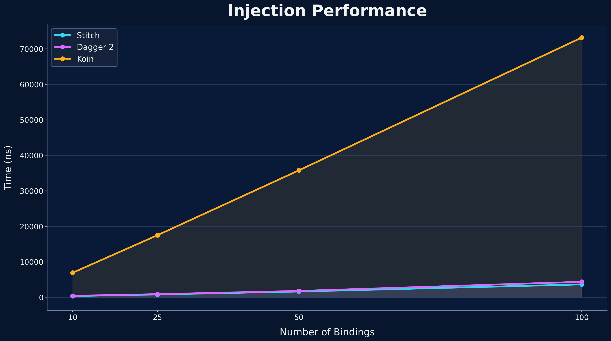
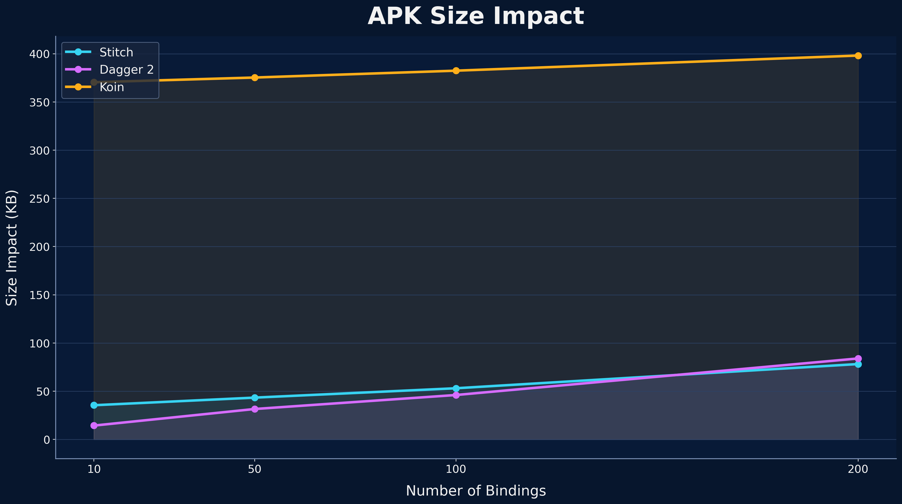
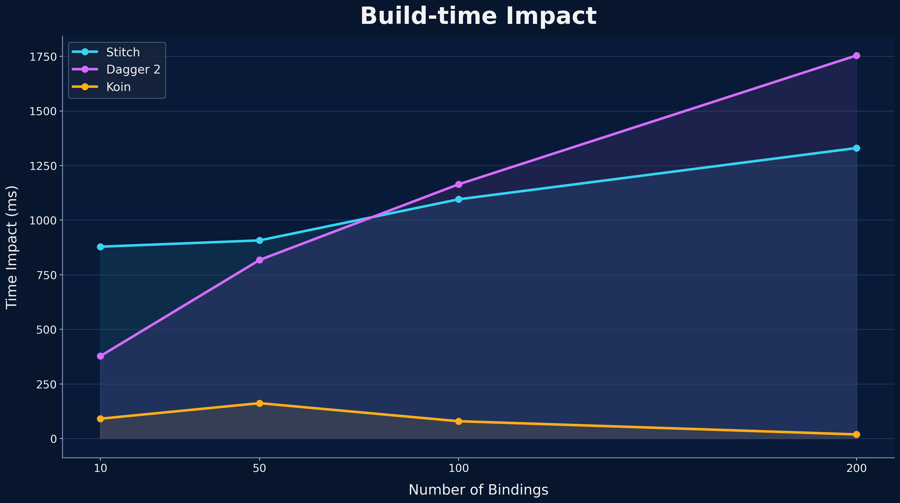

# Stitch

[](https://github.com/harrytmthy/stitch/actions)
[](https://github.com/harrytmthy/stitch/blob/main/LICENSE)

A Kotlin Multiplatform dependency injection library with a precompiled path and a runtime
registration path, designed to replace the Dagger + Koin split with one consistent model.

## Why Stitch?

Today, dependency injection tools often force a tradeoff:

- **Dagger 2** is fast, but has no runtime binding registration and no multiplatform support.
- **Koin** allows runtime registration, but has slower resolutions and higher APK-size impact.
- Using **Dagger 2 + Koin** means carrying two mental models and the combined trade-offs.

Stitch brings both models into one library without the combined trade-offs.

## At a Glance

| Capability                         |       Stitch        | Dagger 2  |   Koin    |
|------------------------------------|:-------------------:|:---------:|:---------:|
| Runtime binding registration       |          ✅          |     ❌     |     ✅     |
| Parent-child scope dependencies    |          ✅          |     ✅     |     ❌     |
| Kotlin Multiplatform support       |          ✅          |     ❌     |     ✅     |
| Amount of rituals (boilerplate)    |      ✅ Lowest       | ❌ Highest |   ✅ Low   |
| Injection performance              |      ✅ Fastest      |  ✅ Fast   | ❌ Slowest |
| APK size impact on larger graphs   |      ✅ Lowest       |   ✅ Low   | ❌ Highest |
| Build-time impact on larger graphs | ✅ Lower than Dagger | ❌ Highest | ✅ Lowest  |

**Notes:**
- "Larger graphs" refers to projects with 100-200+ registered bindings.
- See [Performance Benchmarks](#performance-benchmarks) for the measurement details.

## Installation

### Runtime registration path

```kotlin
dependencies {
    implementation("io.github.harrytmthy:stitch:1.0.0-rc01")
}
```

### Precompiled path

```kotlin
dependencies {
    implementation("io.github.harrytmthy:stitch:1.0.0-rc01")
    compileOnly("io.github.harrytmthy:stitch-annotations:1.0.0-rc01")
    ksp("io.github.harrytmthy:stitch-ksp:1.0.0-rc01")
}
```

You can use either path independently, or combine both in the same project.

## Basic Usage

### Runtime registration path

Create a scope reference and a module:

```kotlin
// Top-level declaration
val activityScope = scope("activity")

val coreModule = module {
    singleton { LoggerImpl() }.bind<Logger>()
}

val homeModule = module {
    factory { HomeConfig() }
    scoped(activityScope) { HomeViewModel(logger = get(), config = get()) }
}
```

Register the modules:

```kotlin
Stitch.register(coreModule, homeModule)

// Alternatively, in a multi-module environment
coreModule.register() // or Stitch.register(coreModule)
homeModule.register() // or Stitch.register(homeModule)
```

Resolve singleton and factory bindings:

```kotlin
val config: HomeConfig = Stitch.get()

// Lazy initialization
val logger by Stitch.inject<Logger>()
```

Resolve scoped bindings:

```kotlin
val homeActivityScope = activityScope.createScope()
val viewModel: HomeViewModel = homeActivityScope.get()

// Cleanup
homeActivityScope.close()
```

Use `dependsOn()` to establish parent-child dependencies:

```kotlin
// One-time setup
val fragmentScope = scope("fragment").dependsOn(activityScope)

// Use it anywhere
val homeActivityScope = activityScope.createScope()
val homeFragmentScope = homeActivityScope.createChildScope(fragmentScope)
val activityViewModel = homeFragmentScope.get<HomeViewModel>()
```

### Precompiled path

#### One-time setup

Annotate any class in the main module with `@StitchRoot`:

```kotlin
@StitchRoot
class SampleApp : Application()
```

Build, then initialize the generated root graph:

```kotlin
StitchInjector.init(StitchSingletonGraph())
```

Add other scopes, where each scope represents a generated graph:

```kotlin
@Scope // Any scope is a child of @Singleton by default
@Retention(AnnotationRetention.BINARY)
annotation class Activity

@Scope
@DependsOn(Activity::class) // Makes @Fragment a child of @Activity
@Retention(AnnotationRetention.BINARY)
annotation class Fragment
```

#### Providing and requesting bindings

To provide a binding, use an `@Inject`-annotated constructor or an `@Provides`-annotated function:

```kotlin
@Activity
class HomeViewModel @Inject constructor(
    private val logger: Logger,
) : ViewModel() { /* ... */ }

// Anywhere, even at top-level
@Singleton
@Provides
@Binds(aliases = [Logger::class]) // Binds LoggerImpl to Logger
fun provideLogger(): LoggerImpl = LoggerImpl()
```

To request the provided binding, use an `@Inject`-annotated field:

```kotlin
class HomeActivity : AppCompatActivity() {
    
    @Inject
    lateinit var viewModel: HomeViewModel
}
```

`HomeViewModel` is provided in `@Activity`, while the parent of `@Activity` is `@Singleton`. So,
to inject it, create the activity graph's injector from its parent:

```kotlin
val activityInjector = StitchInjector.getSingletonGraph()
    .createInjectorForChildScope("activity") // Case-insensitive

// Injects HomeViewModel and other @Inject-annotated fields (if any)
activityInjector.inject(this)
```

Unlike Dagger 2, there is no `@Module` or `@Component`. Graphs are generated in the same module as
the `@StitchRoot`-annotated class.

## Performance Benchmarks

Stitch was benchmarked across three dimensions:

### Injection performance

Stitch is **1.10-1.20× faster than Dagger 2** and **19-22× faster than Koin**.



| Bindings | Stitch           | Dagger 2                     | Koin                        |
|----------|------------------|------------------------------|-----------------------------|
| 10       | **363.41 ns**    | 429.67 ns *(1.18× slower)*   | 6,934.35 ns *(19× slower)*  |
| 25       | **814.54 ns**    | 898.73 ns *(1.10× slower)*   | 17,511.96 ns *(21× slower)* |
| 50       | **1,634.60 ns**  | 1,806.24 ns *(1.10× slower)* | 35,772.29 ns *(22× slower)* |
| 100      | **3,640.85 ns**  | 4,384.39 ns *(1.20× slower)* | 73,161.62 ns *(20× slower)* |

### APK size impact

Stitch stays **5-10× below Koin** across all graph sizes. Dagger has a smaller APK footprint on
small graphs, but Stitch crosses below Dagger at ~200 bindings.



| Bindings | Stitch       | Dagger 2                    | Koin                     |
|----------|--------------|-----------------------------|--------------------------|
| 10       | **+35.5 KB** | +14.4 KB *(0.41× larger)*   | +370.4 KB *(10× larger)* |
| 50       | **+43.4 KB** | +31.6 KB *(0.73× larger)*   | +375.3 KB *(9× larger)*  |
| 100      | **+53.1 KB** | +46.1 KB *(0.87× larger)*   | +382.4 KB *(7× larger)*  |
| 200      | **+78.2 KB** | +84.0 KB *(1.07× larger)*   | +398.1 KB *(5× larger)*  |

### Build-time impact

Stitch has a larger build-time overhead than Dagger on small graphs, but crosses below Dagger at
~100 bindings and scales better from there. Koin has the smallest overhead.



| Bindings | Stitch           | Dagger 2                      | Koin                        |
|----------|------------------|-------------------------------|-----------------------------|
| 10       | **+878.42 ms**   | +377.69 ms *(0.43× larger)*   | +91.03 ms *(0.10× larger)*  |
| 50       | **+907.34 ms**   | +817.78 ms *(0.90× larger)*   | +162.14 ms *(0.18× larger)* |
| 100      | **+1,095.39 ms** | +1,164.09 ms *(1.06× larger)* | +79.53 ms *(0.07× larger)*  |
| 200      | **+1,330.23 ms** | +1,754.03 ms *(1.32× larger)* | +19.10 ms *(0.01× larger)*  |

Stitch scales better than Dagger as graph size grows, while remaining far ahead of Koin in injection
performance and APK size impact.

## Migrating to Stitch

Looking to move from Dagger 2, Hilt, or Koin? See [MIGRATION.md](docs/MIGRATION.md).

## License

```text
Apache License 2.0
Copyright (c) 2026 Harry Timothy Tumalewa
```
